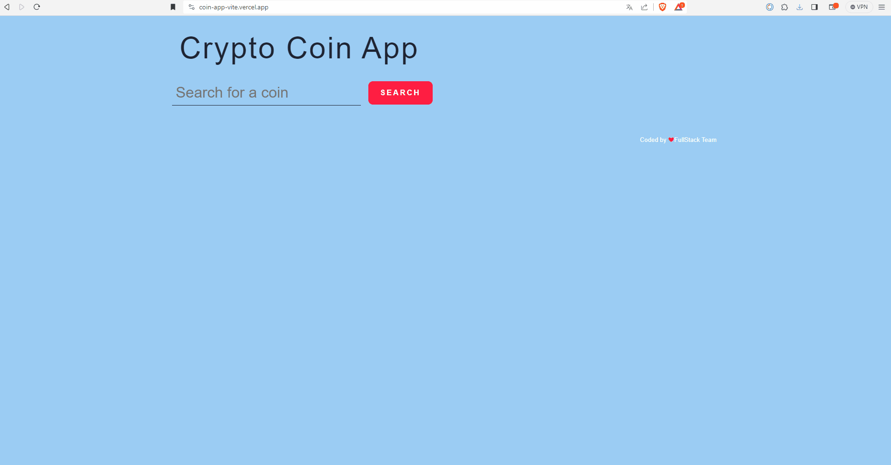

# 🚀 Crypto Coin App 

Crypto Coin App is a JavaScript application that allows users to search cryptocurrencies and view their current market data. The app fetches real-time data from a crypto API and displays it dynamically on the page.

---
## 🌐 Live Demo

## Live
[Demo](https://coin-app-vite.vercel.app/) 

---

## 📸 Preview

---

## 🎯 Purpose

- Work with a real crypto API  
- Fetch data using Axios  
- Use async / await structure  
- Practice DOM manipulation  

---

## 🧠 Learning Outcomes

- API integration  
- Search-based data filtering  
- Prevent duplicate data rendering  
- User notifications  

---

## 🔍 Features

- Search cryptocurrency by name  
- Display coin data in cards  
- Show warning when the same coin is searched again  

---

## ⚙️ Technologies

- HTML5, CSS3  
- JavaScript (ES6+)  
- Axios  
- SweetAlert2  